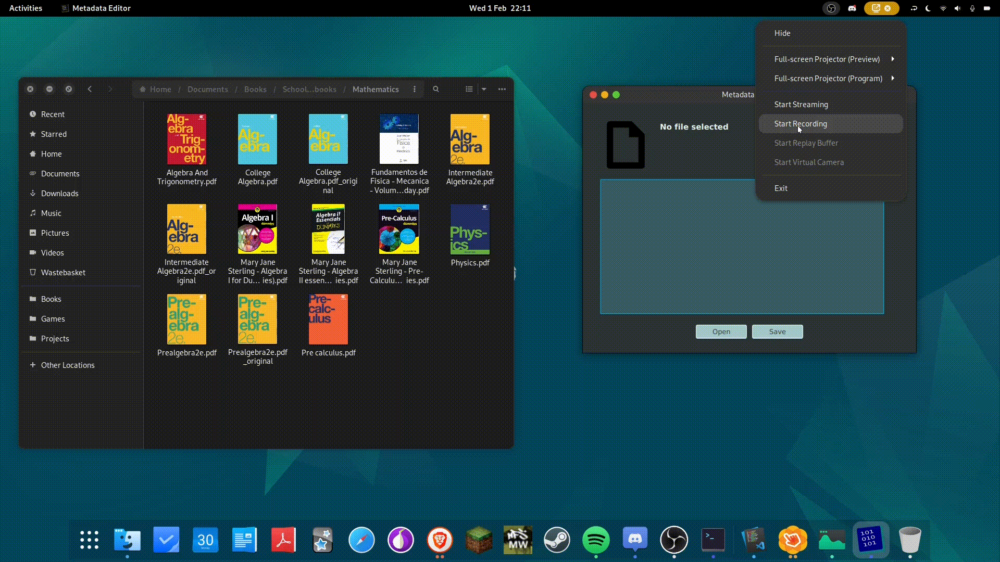

# Metadata Editor Project

1. [Description](#metadata-editor)
2. [Dependencies](#dependencies)
3. [Installation](#installation)
4. [Basic Usage](#basic-usage)
    1. [Reading files metadata](#reading-files-metadata)
    2. [Writing Metadata into a file](#writing-custom-metadata-into-a-file)
5. [Author](#authors)
6. [Licence](#licence)

## Description

Metadata Editor is a JavaFX application that works as an interface for reading
and editing files metadata easily. The project is the implemented GUI itself.
The responsible for editing and writing metadata into files is the
[exiftool program][exiftool_link], written by Phil Harvey.

For now, this application is available for Linux systems only (and probably also
for others Unix-based systems). A Windows version might be available.

## Dependencies

* exiftool. It must be installed in your system and available in your path.

## Installation

This program provides a deb package, so the user only need to type
`sudo apt-get install metadata-editor_1.0.0-1_amd64.deb`.

## Basic Usage

The application itself is pretty simple as it is intended to do the common
tasks, reading and writing.

### Reading Files Metadata
<figure>
    
    <figcaption>Drag and Drop support for opening files</figcaption>
</figure>

<figure>
    
    <figcaption>It's also possible to manually open files</figcaption>
</figure>

### Writing Custom Metadata into a File

<figure>
    
    <figcaption>Editing metadata fields</figcaption>
</figure>

## Authors

* De Moura (aka smolBlackCat)

[exiftool_link]: https://github.com/exiftool/exiftool
