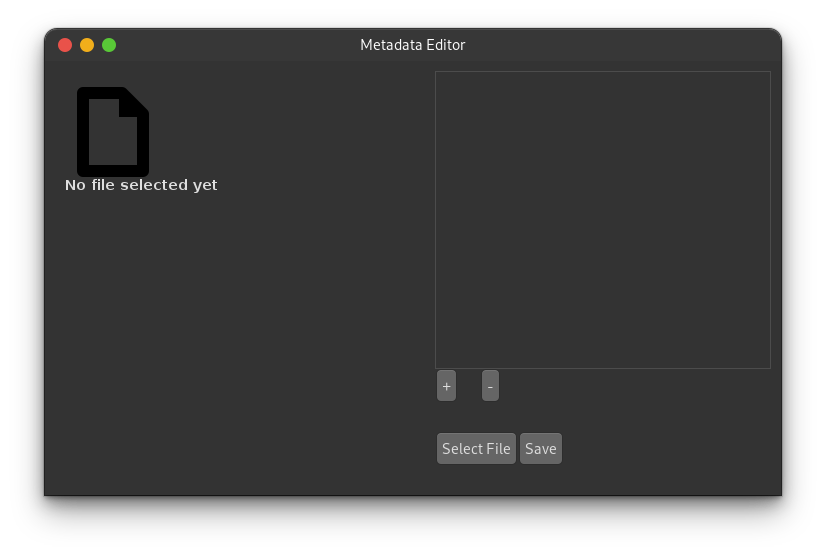

===============
Metadata Editor
===============

Description
===========

---------------------

MetadataEditor is app written in Java that is responsible for reading and
changing metadata on Unix environments with a very simple GUI. This is the GUI
implementation only using Java Swing, the real processing is made by the
exiftool_, a tool written Perl.

.. _exiftool: https://github.com/exiftool/exiftool

Remember, the exiftool binary isn't bundled with the app, therefore you must
have exiftool installed to the app work properly.

Dependencies
============

* exiftool
* java >= 11

Installation
============

After the installation of the app dependencies, all you have to do now is just
go to the project folder and run (use sudo of course)::

    ./install

And done, the application is already installed and ready to go.
